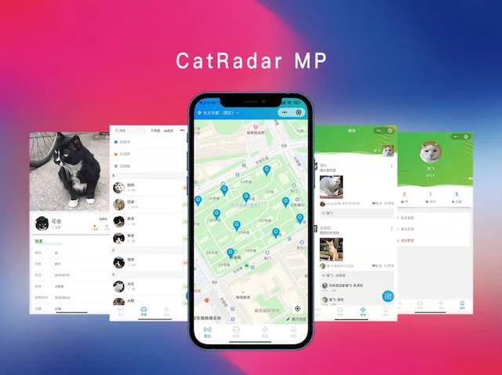
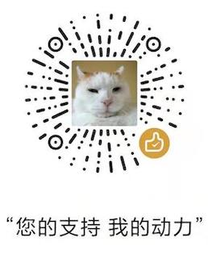

## 功能简介
这是一款帮助社区和高校进行区域化流浪猫管理的神器

* 以社区为单位管理流浪猫

* 社区志愿者可自行建立猫区，共同管理流浪猫

* 成员可发布猫咪动态，互相交流

* 通过就近领养让更多猫咪找到靠谱的主人

## 项目依赖

* [dcloudio/uni-app](https://github.com/dcloudio/uni-app)

* [YanxinNet/uView](https://github.com/YanxinNet/uView)

* [weilanwl/ColorUI](https://github.com/weilanwl/ColorUI)			  

 
## 跨端情况
本项目使用unicloud开发，支持多端部署。目前主要支持微信小程序、H5、APP，其他小程序可能存在一定兼容问题。

## 线上版本

## 使用方法
* 下载HBuilderX

* cloudfunctions/目录上传云函数

* uniCloud/database/目录上传数据集合Schema

* manifest.json中配置appkey等信息

## 捐赠支持
救助艰难，如果您觉得此项目有所帮助，可以捐赠支持我，哪怕是一袋猫粮也好。

## 交流反馈
如果您有想法和建议，欢迎提issue，或微信与我交流。

